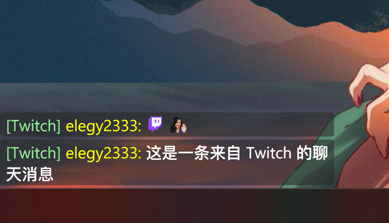
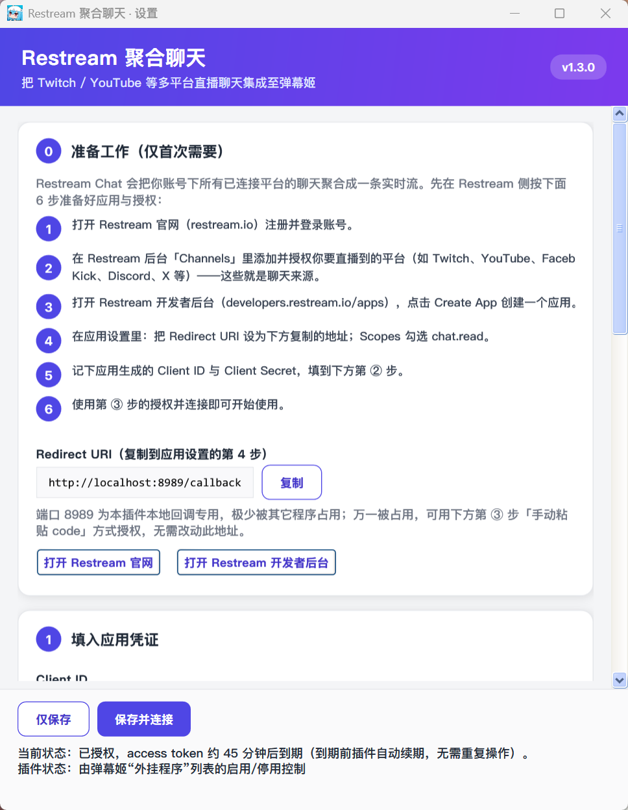

# RestreamChatPlugin

[弹幕姬](https://www.danmuji.org/)插件，通过 Restream Chat API 把 Twitch / YouTube / Kick 等多平台直播聊天聚合为弹幕姬弹幕。**无需连接 B 站直播间**，只要有一个 Restream 账号并授权 Chat API，即可把各平台的聊天与表情直接显示在本地的弹幕姬窗口里。

## 功能特性

- **多平台聊天聚合**：连接 Restream Chat API 后，同时接收 Twitch、YouTube、Kick 等已绑定平台的聊天消息。
- **OAuth 授权登录**：在插件设置窗口点击授权，跳转 Restream 登录并回调到本地 `http://localhost:8989/callback` 获取访问令牌；令牌过期后使用 refresh_token 自动续期。
- **代理设置**：支持三种模式——直连、使用系统代理、自定义代理地址，分别对 HTTP 请求与 WebSocket 连接生效（适用于网络环境特殊的用户）。
- **表情渲染**：可选「独立浮层」，把 Twitch / Kappa 等第三方表情包渲染成图片；默认关闭，使用弹幕姬自带浮层。
- **本地化**：界面跟随弹幕姬的语言设置（中文 / 日本語 / English）。
- **启用记忆**：弹幕姬不持久化插件的启用/停用状态，开启「自动启用」后会在弹幕姬启动时自动恢复启用。
- **单文件部署**：产物为单个 `RestreamChatPlugin.dll`，无需额外依赖文件。

## 环境要求

- Windows + [.NET Framework 4.8](https://dotnet.microsoft.com/download/dotnet-framework/net48)
- [弹幕姬（bililive_dm）](https://www.danmuji.org/)

## 下载

- [GitHub Releases](https://github.com/wan0ge/RestreamChatPlugin/releases)：`RestreamChatPlugin.dll`（单个 DLL，无需额外依赖文件）
- [弹幕姬官网插件页](https://www.danmuji.org/plugins/)

## 安装

下载 `RestreamChatPlugin.dll`，放入 `我的文档\弹幕姬\plugins\`，重启弹幕姬即可。插件首次运行会在 `Plugins\RestreamChatPlugin\` 下自动创建数据目录，用于存放配置文件与表情包缓存。

## 预览

**消息效果**（多平台聊天滚成弹幕姬弹幕）



**设置窗口**（授权、代理、浮层等）



## 使用方法

在弹幕姬「插件」选项卡找到 **Restream 聚合聊天集成**，右键「管理」打开设置窗口，按以下五个步骤操作：

**① 准备工作（仅首次需要）**

Restream Chat 会把你账号下所有已连接平台的聊天聚合成一条实时流，先在 Restream 侧完成准备：

1. 打开 [Restream 官网](https://restream.io) 注册并登录账号。
2. 在后台「Channels」里添加并授权你要直播到的平台（Twitch、YouTube、Facebook、Kick、Discord、X 等）——这些就是聊天来源。
3. 打开 [Restream 开发者后台](https://developers.restream.io/apps)，点击 Create App 创建一个应用。
4. 在应用设置里：把 Redirect URI 设为 `http://localhost:8989/callback`；Scopes 勾选 `chat.read`。
5. 记下应用生成的 Client ID 与 Client Secret，填到下方第 ② 步。
6. 用第 ③ 步的授权并连接即可开始使用。

> 端口 8989 为插件本地回调专用，极少被占用；万一被占用，可用第 ③ 步「手动粘贴 code」方式授权，无需改动此地址。

**② 填入应用凭证**

在第 ② 步填入 Client ID 与 Client Secret。

**③ 授权并连接**

点击「登录并授权」会自动打开浏览器，在 Restream 页面登录并同意授权，插件通过本地回调自动拿到 token，无需手动复制 code。

- 备用：若自动授权失败（如端口被占用），复制回调地址里的 `?code=` 值，用「用 code 兑换并连接」完成授权。

**④ 可选设置**

- 代理模式：默认「直连（不使用代理）」；如需走代理可选「系统代理」或填写「自定义代理」地址（示例 `http://127.0.0.1:7890`）。
- 手动 access token（选填）：不想走 OAuth 时直接粘贴。

**⑤ 显示与高级**

- 独立浮层：开启后把 Twitch / Kappa 等表情包渲染成图片；默认关闭，使用弹幕姬自带浮层。
- 独立浮层布局：弹幕滚动 / 侧边栏列表；侧边栏模式下可选左侧 / 右侧。
- 调试日志：开启后把连接 / 授权 / 收消息等细节写入插件目录的 `调试日志.log`，便于排查问题。

完成后点击「保存并连接」，或回到弹幕姬右键本插件选择「启用」，即可开始接收多平台聊天。插件状态由弹幕姬「外挂程序」列表的启用 / 停用控制。

## 构建

本插件为弹幕姬（bililive_dm）的插件，依赖其 `BilibiliDM_PluginFramework` 框架，无法脱离框架独立编译。

- **Visual Studio**：在 `BilibiliDM_PluginFramework` 框架工程可用的环境下（例如克隆 bililive_dm 主仓库），用 Visual Studio 打开 `RestreamChatPlugin\RestreamChatPlugin.csproj`（或主仓库的 `Bililive_dm.sln`），构建 `RestreamChatPlugin` 工程即可。也可直接运行 `RestreamChatPlugin\build.bat`（需已安装 VS 且勾选「.NET 桌面开发」），它会调用 VS 自带的 MSBuild 编译出 `RestreamChatPlugin.dll`。
- **命令行**：在已存在预编译 `BilibiliDM_PluginFramework.dll` 的环境中执行
  ```
  dotnet build RestreamChatPlugin.csproj /p:Configuration=Debug /p:Platform=AnyCPU /p:BuildProjectReferences=false
  ```
  产物位于 `RestreamChatPlugin\bin\Debug\RestreamChatPlugin.dll`，为单个 DLL 文件（无需额外依赖文件）。

## 测试

- `RestreamChatPlugin.Tests`：基于 MSTest 的单元测试，覆盖消息帧解析（ParseFrame）、弹幕命名（BuildDanmakuName）、配置目录与代理模式（含旧字段迁移）、token 过期与鉴权失败判定、授权码提取（ExtractAuthCode）、第三方表情地址拼装（BTTV/7TV）、emoji 码点与分段、表情包缓存键、动态表情地址改写（Twitch v1→v2）与 GIF 魔数识别等逻辑。
- `RestreamChatPlugin.Tests.Runner`：轻量反射运行器，在无法使用 VSTest testhost 的环境下直接加载测试程序集并逐个执行 `[TestMethod]`，便于在仅具备 .NET Framework 4.8 运行时的机器上查看真实结果。

## 目录结构

```
RestreamChatPlugin-oss/
├── RestreamChatPlugin/              插件主工程（legacy csproj，产物为单个 DLL）
│   ├── RestreamPlugin.cs            插件入口（DMPlugin 实现）：生命周期、授权流程编排、WebSocket 连接与重连、独立浮层开关、本地化、版本号 PluginVer
│   ├── RestreamChatClient.cs        Restream Chat API 客户端：WebSocket 连接、消息帧解析（ParseFrame）、事件/聊天/订阅类型、代理模式接入
│   ├── RestreamOverlayWindow.cs     独立浮层窗口（WPF，纯代码构建）：透明/置顶/鼠标穿透；滚动与侧边栏布局；emoji 与第三方表情图片渲染；GIF 动画；置顶保活
│   ├── EmoteProvider.cs             第三方表情（BTTV/FFZ/7TV）名称→图片地址映射，适配当前 API；URL 拼装辅助
│   ├── AdminWindow.cs               设置窗口：授权、代理、独立浮层开关与布局、调试日志、本地化（中/日/英）
│   ├── Config.cs                    配置读写与目录解析（PluginRoot）、代理模式解析与旧字段迁移、HttpClient/WebSocket 代理应用
│   ├── L10n.cs                      本地化辅助：按进程 CultureInfo 选 中/日/英
│   ├── build.bat                   调用 VS 自带 MSBuild 编译本工程
│   ├── RestreamChatPlugin.csproj    工程文件（legacy csproj，直接程序集引用，无 NuGet 包引用）
│   ├── Properties/
│   │   └── AssemblyInfo.cs         程序集元信息（版本号 AssemblyVersion / AssemblyFileVersion）
│   └── Libs/
│       └── Newtonsoft.Json.dll     编译期引用（Private=False，不复制到输出）
├── RestreamChatPlugin.Tests/       MSTest 单元测试
│   ├── Tests.cs                     覆盖 ParseFrame、BuildDanmakuName、Config.PluginRoot、Newtonsoft.Json 编译期引用约定、emoji 码点/分段/缓存、表情包缓存、ExtractAuthCode、代理模式、EmoteProvider URL 拼装等常规与边缘情况
│   ├── Tests_EmoteAndGif.cs         覆盖动态表情修复相关纯逻辑：TwitchAnimatedEmoteUrl（v1→v2 改写，含旧版数字 id/非 Twitch/BTTV/7TV/非法 URL 等分支）、ToLocalPath（file:// 归一）、IsExpired（5 分钟续期缓冲边界）、IsGifFile（GIF 魔数判定，含 PNG/不存在文件）
│   └── RestreamChatPlugin.Tests.csproj  测试工程文件
├── RestreamChatPlugin.Tests.Runner/  反射式测试运行器（无 VSTest testhost 环境下直接加载测试程序集逐个执行）
│   ├── Program.cs                   运行器入口
│   └── Runner.csproj                运行器工程文件
├── dist/
│   └── RestreamChatPlugin.dll      构建产物（单个 DLL），即发版用 DLL
├── docs/
│   ├── preview.png                 消息效果预览图
│   └── preview2.png                设置窗口预览图
├── LICENSE                         MIT 许可证
├── README.md                       本说明文档
└── .gitignore                      Git 忽略规则（bin/obj 等）
```

## 许可证

[MIT](LICENSE) © 2026 wan0ge

## 联系方式

意见或建议请发邮件至 HXDD233@qq.com
